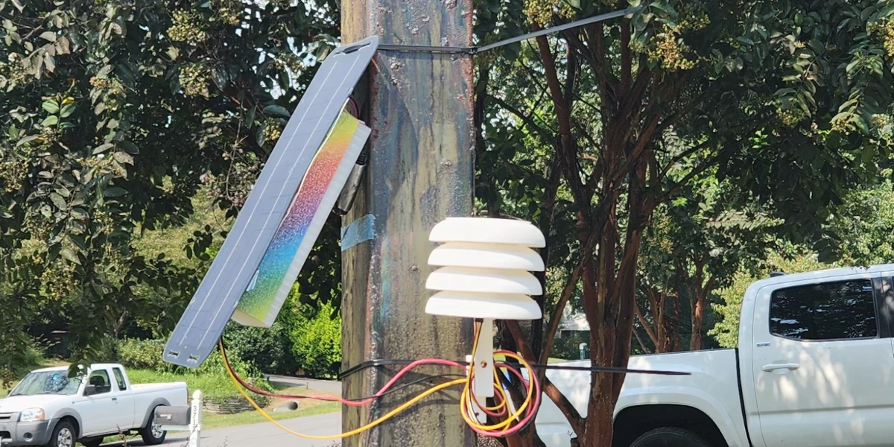
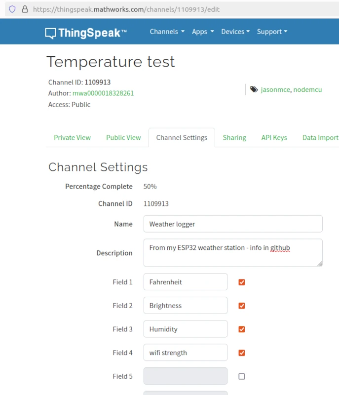
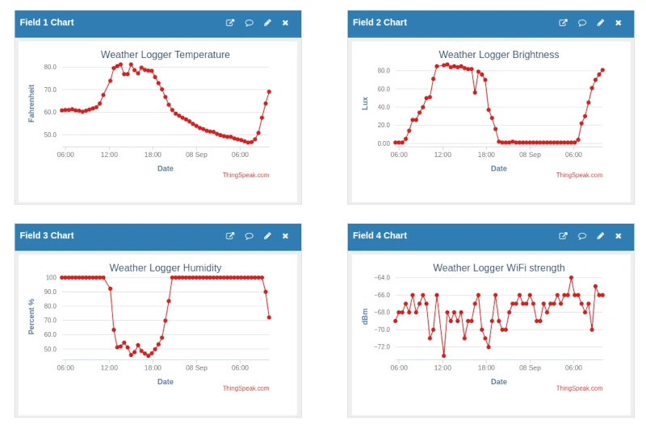
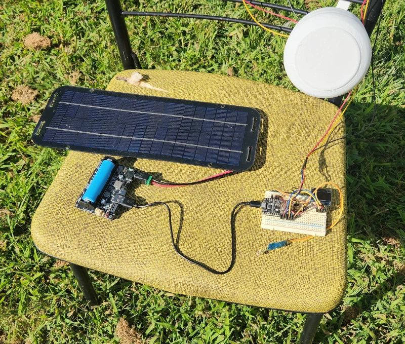
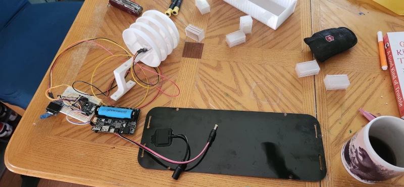
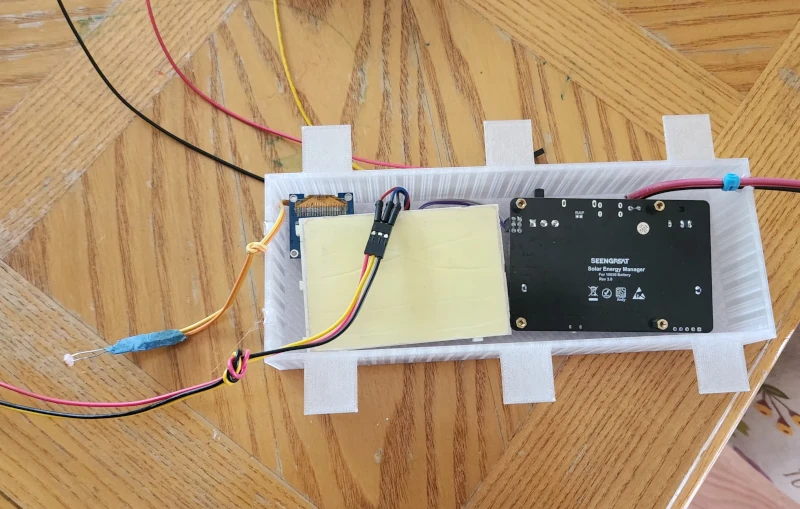

# Arduino Weather Logger



An IoT weather monitoring system that collects temperature, humidity, and light level data and sends it to ThingSpeak for visualization and analysis.

## Features

- 🌡️ Temperature monitoring using DHT22 sensor
- 💧 Humidity measurement
- ☀️ Light level detection
- 📶 WiFi signal strength monitoring
- 📊 Data visualization on ThingSpeak
- 🔋 Power-efficient design with deep sleep mode
- 🖥️ Local OLED display for current readings

## Hardware Requirements

- NodeMCU V2.0 (ESP8266)
- DHT22 Temperature & Humidity Sensor
- Photocell (Light Dependent Resistor)
- 10kΩ Resistor
- Breadboard and jumper wires
- USB cable for programming

## Hardware Setup

### Pin Connections

| NodeMCU Pin | Connection               |
|-------------|--------------------------|
| D0          | Connected to RST (for deep sleep) |
| D1          | DHT22 Data Pin           |
| A0          | Light Sensor Circuit     |
| 3.3V        | Power for sensors        |
| GND         | Ground                   |

### Light Sensor Circuit
1. Connect one leg of the photocell to 3.3V
2. Connect the other leg to A0 and one end of 10kΩ resistor
3. Connect the other end of the resistor to GND

## Software Requirements

- Arduino IDE with ESP8266 board support
- Required Arduino Libraries:
  - `ESP8266WiFi`
  - `ThingSpeak`
  - `DHT sensor library`

## Setup Instructions

1. **Clone this repository** to your Arduino projects folder
2. **Rename `credentials.example.h` to `credentials.h`**
3. **Edit `credentials.h`** with your WiFi and ThingSpeak credentials:
   ```cpp
   #define SECRET_SSID "your_wifi_ssid"
   #define SECRET_PASS "your_wifi_password"
   #define SECRET_CH_ID 1109913         // Replace with your ThingSpeak Channel ID
   #define SECRET_WRITE_APIKEY "YOUR_WRITE_API_KEY"  // Replace with your ThingSpeak Write API Key
   ```

4. **Upload the sketch** to your NodeMCU
5. **Monitor the Serial Console** (9600 baud) to verify operation

## ThingSpeak Integration

This project sends data to a ThingSpeak channel with the following field mapping:

| Field | Measurement |
|-------|-------------|
| 1     | Temperature (°F) |
| 2     | Light Level (%) |
| 3     | Humidity (%) |
| 4     | WiFi Signal Strength (dBm) |

### Channel Configuration



### Data Visualization



View your data at: [ThingSpeak Channel](https://thingspeak.mathworks.com/channels/1109913/)

## Power Management

The device is designed for low power consumption:
- Deep sleep mode between readings (default: 30 minutes)
- Wakes up to take measurements and transmit data
- LED indicator shows when the device is active

## Field Testing



## Assembly

I replaced the modular solar input and USB power jacks with custom wiring



I used TinkerCAD to design a box to house the NodeMCU breadboard and power
components I had in a weatherproof enclosure that could be mounted behind
the solar panel for weather protection and consolidation.  It's translucent
so the power LED can be seen.



## Customization

You can adjust the following in the code:
- Sleep duration: Modify `sleepSeconds` in `weather-logger.ino`
- Sensor pins: Update pin definitions in the respective header files
- Measurement units: Adjust temperature conversion in `dht22.cpp` if needed

## Troubleshooting

- **Device not connecting to WiFi**: Check your credentials and network settings
- **Incorrect sensor readings**: Verify wiring and sensor connections
- **Deep sleep not working**: Ensure D0 is connected to RST
- **Upload issues**: Disconnect D0 from RST before uploading new code

## License

This project is open source and available under the MIT License.

## Acknowledgments

- Based on various open-source weather monitoring projects
- Uses ThingSpeak for data visualization
- Inspired by the ESP8266 community
